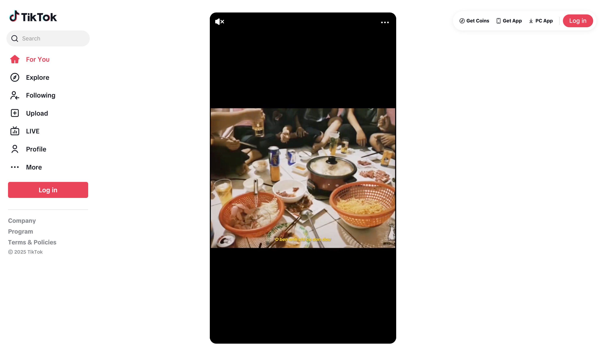
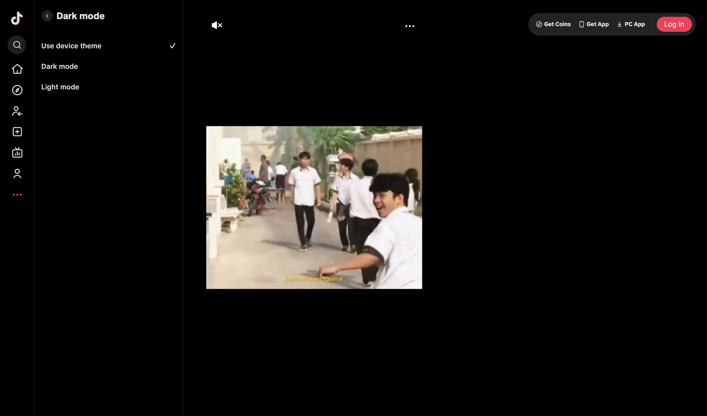
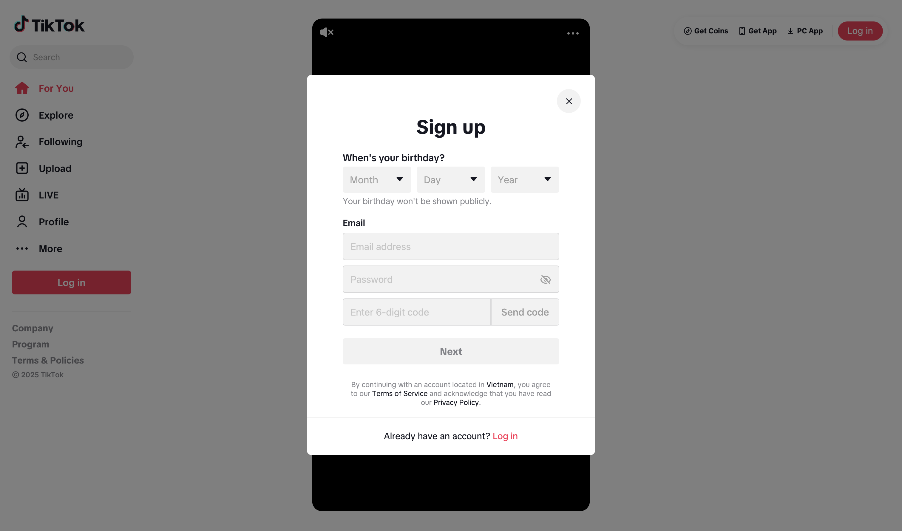
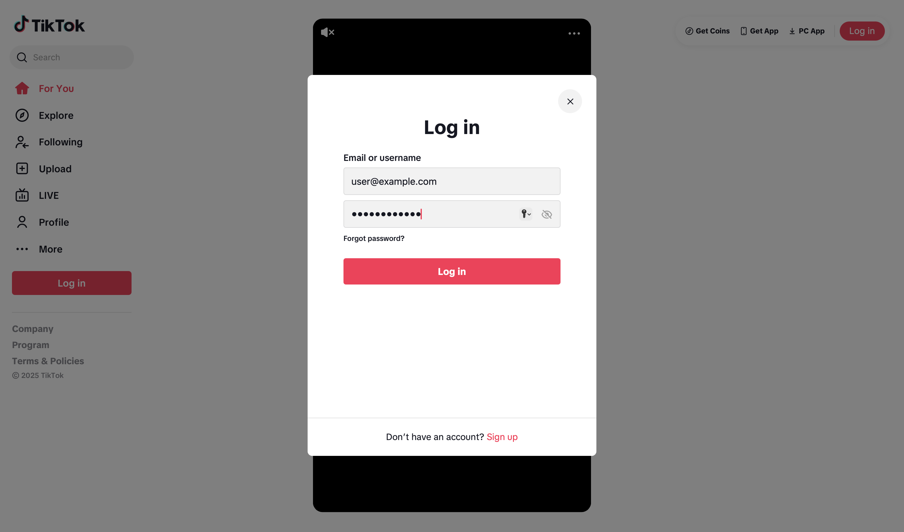
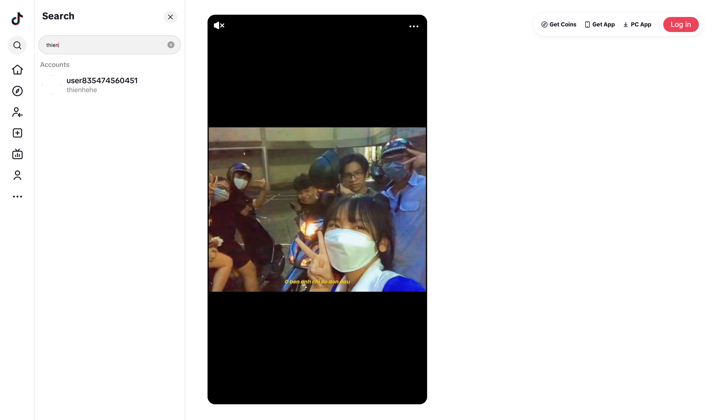

# TikTok Clone - Frontend

A React.js frontend application for a TikTok-like social media platform built with modern React patterns and responsive design.

## Main page



## Drak mode



## Signup Modal



## Login modal



## Search user



### Completed Features

- Complete authentication system (login, register, password reset)
- User registration with real-time validation
- Username and birthdate validation
- Responsive mobile-first design
- State management with React Context
- Error handling and loading states
- Modal-based authentication flow

### Not Yet Implemented

- Video upload functionality
- Video feed with real data
- Video interactions (like, comment, share)
- Infinite scroll
- User profiles and following
- Real video streaming

> **Note**: The frontend provides a complete authentication experience and UI framework. Video functionality uses placeholder components and static content.

## Table of Contents

- [Features](#features)
- [Technology Stack](#technology-stack)
- [Prerequisites](#prerequisites)
- [Getting Started](#getting-started)
- [Project Structure](#project-structure)
- [Configuration](#configuration)

## Features

### Authentication & User Management

- User registration with email verification support
- Login/logout with JWT token management
- Password reset functionality
- Real-time username availability checking
- Birthdate validation for age verification
- Automatic token refresh handling
- Secure token storage

### UI & Design

- Mobile-first responsive layout
- TikTok-inspired design and navigation
- Reusable component architecture
- SCSS with CSS modules for styling
- Modal-based authentication flows
- Loading states and error handling
- Sidebar navigation and drawer components

### State Management & Architecture

- React Context for global state management
- Custom hooks for API integration
- Centralized loading state coordination
- Error boundary implementation
- Clean separation of concerns
- Debounced input validation

### Development Features

- Path aliases for clean imports
- Component-based architecture
- Custom webpack configuration
- SCSS preprocessing
- Responsive design utilities

**Note**: Video components exist but display static content only. Video upload, streaming, and interaction features require backend API implementation.

## Technology Stack

### Core Framework

- React 19.1.0 - Modern React with latest features
- React Router DOM 7.6.2 - Client-side routing
- React Scripts 5.0.1 - Build tooling and development server

### Styling & UI

- SCSS with CSS Modules - Component-scoped styling
- Normalize.css - Cross-browser consistency
- Responsive design utilities
- Mobile-first approach

### State Management & API

- React Context - Global state management
- Axios 1.9.0 - HTTP client for API communication
- Custom hooks for API integration
- JWT token management

### Development Tools

- Customize-cra & React App Rewired - Build customization
- Babel Module Resolver - Path aliases
- Prettier - Code formatting
- PropTypes - Runtime type checking

## Prerequisites

- Node.js v16 or higher
- npm or yarn package manager
- Backend API running (for authentication features)

## Getting Started

### 1. Clone and Install

```bash
git clone https://github.com/thienel/tiktok-clone-ui.git
cd tiktok-clone-ui/frontend
npm install
```

### 2. Environment Configuration

Create a `.env` file in the root directory:

```env
REACT_APP_API_BASE_URL=http://localhost:5001/api/
REACT_APP_ENV=development
```

### 3. Start Development Server

```bash
npm start
```

The application will be available at [http://localhost:3000](http://localhost:3000)

### 4. Build for Production

```bash
npm run build
```

## Project Structure

```
src/
├── components/          # Reusable UI components
│   ├── LoginModal/      # Authentication modal components
│   ├── Sidebar/         # Navigation sidebar
│   ├── Video/           # Video player component (placeholder)
│   ├── FeedVideo/       # Video feed layout (placeholder)
│   └── ...              # Other UI components
├── context/             # React Context providers
│   ├── AuthContext.js   # Authentication state management
│   ├── LoadingContext.js # Loading states coordination
│   └── ThemeContext.js  # Theme management
├── hooks/               # Custom React hooks
│   ├── useAuth.js       # Authentication hook
│   ├── useUsersAPI.js   # User API operations
│   ├── useDebounce.js   # Input debouncing
│   └── ...              # Other utility hooks
├── pages/               # Route components
│   └── Home/            # Main application page
├── utils/               # Helper functions and utilities
│   ├── api.js           # API configuration and interceptors
│   └── validation.js    # Form validation functions
├── styles/              # Global SCSS styles
├── assets/              # Static assets (images, icons)
└── constants/           # Application constants
```

### Key Architecture Decisions

- **Component-based**: Small, reusable components with single responsibilities
- **Hook-based logic**: Custom hooks for API calls and state management
- **Context for global state**: Avoiding prop drilling while keeping state predictable
- **Path aliases**: Clean imports using `~` for `src/` directory

## Configuration

### Build Customization

The project uses `customize-cra` and `react-app-rewired` for:

- **Path aliases**: `~` points to `src/` directory
- **SCSS with CSS Modules**: Component-scoped styling
- **Custom font loading**: Optimized font delivery

Example import using path alias:

```javascript
import Component from '~/components/Component'
import { useAuth } from '~/hooks'
```

### Environment Variables

- `REACT_APP_API_BASE_URL`: Backend API base URL
- `REACT_APP_ENV`: Environment (development/production)

### Available Scripts

- `npm start`: Start development server
- `npm run build`: Build for production
- `npm test`: Run tests
- `npm run eject`: Eject from Create React App (not recommended)

### Authentication Flow

1. User opens the application
2. If not authenticated, authentication modal is shown
3. User can register with email verification or login
4. JWT tokens are stored in localStorage
5. API requests automatically include authorization headers
6. Tokens are refreshed automatically when expired

**Note**: The application provides a complete authentication experience but video features are placeholder components only.

---

**Made by [thienel](https://github.com/thienel)**
_This project is for learning and experimental purposes._
